# Oauth2.0 (AppAuth)

---

`MacOS Version : Ventura 13.4`

`Xcode Version : 14.3`

`AppAuth Version : 1.6.2`

## 簡介

使用KeyCloak + AppAuth(套件) 實作 Oauth2.0

## KeyCloak

1. 登入KeyCloak後，創建一個Realm
    
    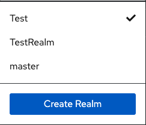
    

1. 輸入Realm Name後點擊 Create
    
    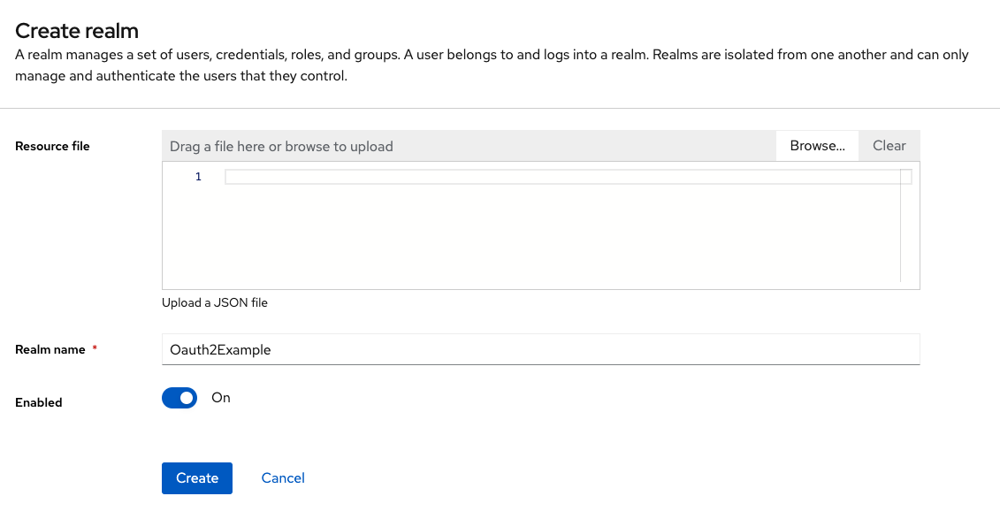
    

1. 切換至剛剛創建的Realm，左邊選取Clients，點擊畫面中的 Create Client
    
    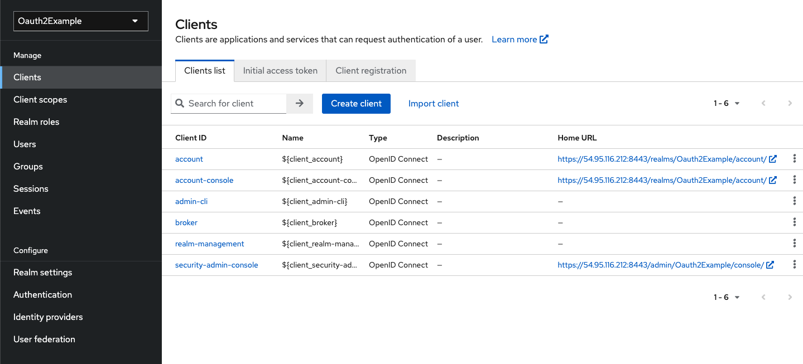
    

1. 設定 Client ID，後兩頁不用設定，直接按儲存就好。
    
    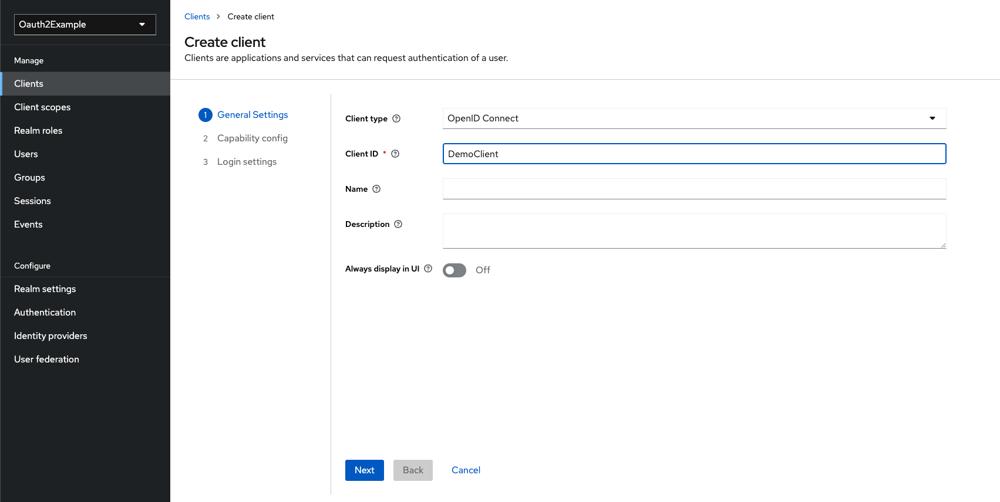
    

1. 左邊選取Users，點擊畫面中的 Create New User
    
    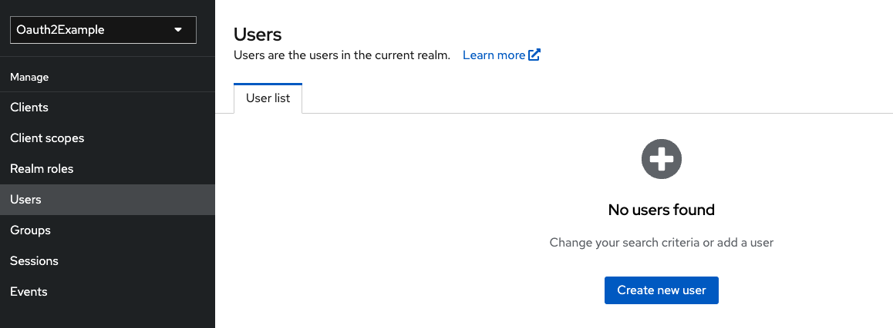
    

1. 輸入部分資料，等等登入時會用到這組帳號
    
    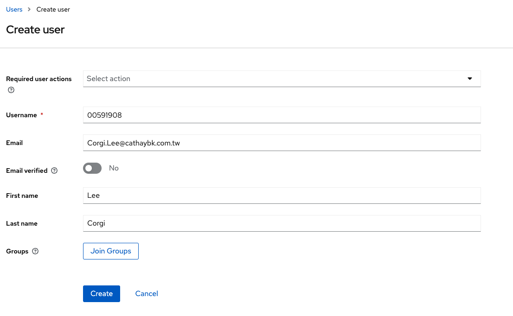
    

1. 點擊剛剛創建的User，選取 Credentials，點擊 Set Password，
( 在上一步驟我們只有創建帳號，但是並沒有設定到密碼 )
    
    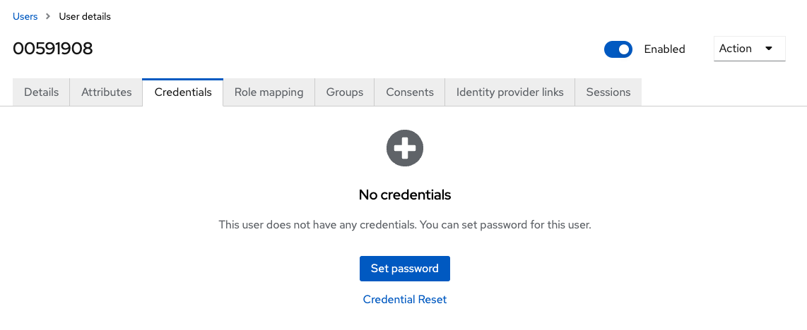
    

1. 輸入密碼後，記得將 Tempoary 選取 Off，否則會在第一次登入後就要求User變更密碼。
    
    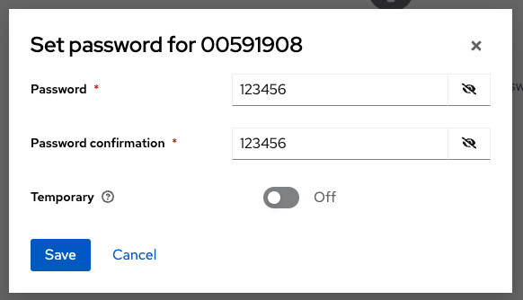
    

1. 回到Client中選取剛剛創建的Client並進行相關設定，其中 **Valid redirect URIs 十分重要**
    
    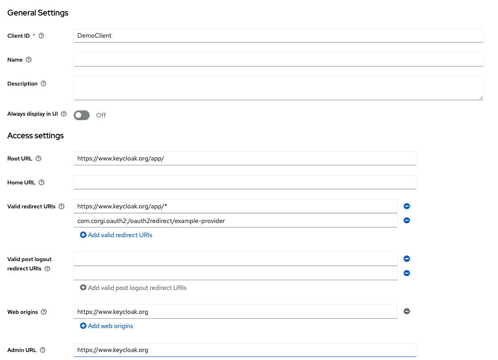
    

## AppAuth

- 支援版本 iOS 7.0 以上
- 安裝套件
    1. Podfile 加入
    
    ```
    pod 'AppAuth'
    ```
    
    1. pod install
- 實作
    1. 在畫面中放置三個Button
        
        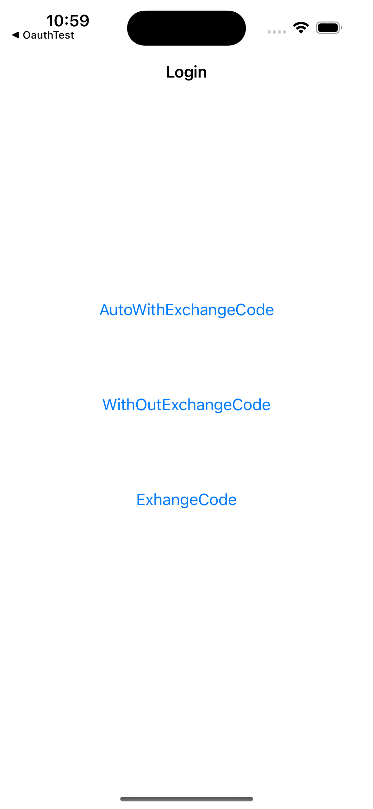
        
    2. AppDelegate
        
        ```swift
        import AppAuth
        import UIKit
        
        @main
        class AppDelegate: UIResponder, UIApplicationDelegate {
        
            var currentAuthorizationFlow: OIDExternalUserAgentSession?
        
            func application(_ application: UIApplication, didFinishLaunchingWithOptions launchOptions: [UIApplication.LaunchOptionsKey: Any]?) -> Bool {
                // Override point for customization after application launch.
                return true
            }
        
            func application(_ app: UIApplication, open url: URL, options: [UIApplication.OpenURLOptionsKey : Any] = [:]) -> Bool {
                if let authorizationFlow = self.currentAuthorizationFlow, authorizationFlow.resumeExternalUserAgentFlow(with: url) {
                    self.currentAuthorizationFlow = nil
                    return true
                }
                
                return false
            }
        
            // MARK: UISceneSession Lifecycle
            
            func application(_ application: UIApplication, configurationForConnecting connectingSceneSession: UISceneSession, options: UIScene.ConnectionOptions) -> UISceneConfiguration {
                // Called when a new scene session is being created.
                // Use this method to select a configuration to create the new scene with.
                return UISceneConfiguration(name: "Default Configuration", sessionRole: connectingSceneSession.role)
            }
        
            func application(_ application: UIApplication, didDiscardSceneSessions sceneSessions: Set<UISceneSession>) {
                // Called when the user discards a scene session.
                // If any sessions were discarded while the application was not running, this will be called shortly after application:didFinishLaunchingWithOptions.
                // Use this method to release any resources that were specific to the discarded scenes, as they will not return.
            }
        
        }
        ```
        
    3. Oauthmanager.swift (管理Oauth State)
        
        ```swift
        import AppAuth
        
        class OauthManager: NSObject {
            static let shared = OauthManager()
            
            var authState: OIDAuthState?
            
            let kAppAuthExampleAuthStateKey: String = "authState"
            
            func saveState() {
                var data: Data? = nil
                
                if let authState = self.authState {
                    data = NSKeyedArchiver.archivedData(withRootObject: authState)
                }
                
                if let userDefaults = UserDefaults(suiteName: "group.net.openid.appauth.Example") {
                    userDefaults.set(data, forKey: kAppAuthExampleAuthStateKey)
                    userDefaults.synchronize()
                }
            }
            
            func loadState() {
                guard let data = UserDefaults(suiteName: "group.net.openid.appauth.Example")?.object(forKey: kAppAuthExampleAuthStateKey) as? Data else {
                    return
                }
                
                if let authState = NSKeyedUnarchiver.unarchiveObject(with: data) as? OIDAuthState {
                    self.setAuthState(authState)
                }
            }
            
            func setAuthState(_ authState: OIDAuthState?) {
                if self.authState == authState {
                    return
                }
                self.authState = authState
                self.authState?.stateChangeDelegate = self
                self.stateChanged()
            }
            
            func stateChanged() {
                self.saveState()
            }
            
        }
        
        //MARK: OIDAuthState Delegate
        extension OauthManager: OIDAuthStateChangeDelegate, OIDAuthStateErrorDelegate {
            
            func didChange(_ state: OIDAuthState) {
                self.stateChanged()
            }
            
            func authState(_ state: OIDAuthState, didEncounterAuthorizationError error: Error) {
                print("Received authorization error: \(error)")
            }
        }
        ```
        
    4. 在ViewController宣告以下參數
        
        ```swift
        // KeyCloak Server Realm Issuer
        let issuer: String = "https://54.95.116.212:8443/realms/Oauth2Example";
        
        //The OAuth client ID.
        let clientID: String = "DemoClient";
        
        //The OAuth redirect URI for the clientID
        let redirectURI: String = "com.corgi.oauth2:/oauth2redirect/example-provider";
        
        var configuration: OIDServiceConfiguration? = nil
        ```
        
        Issuer與其他EndPoint可以在這裡查看。
        
        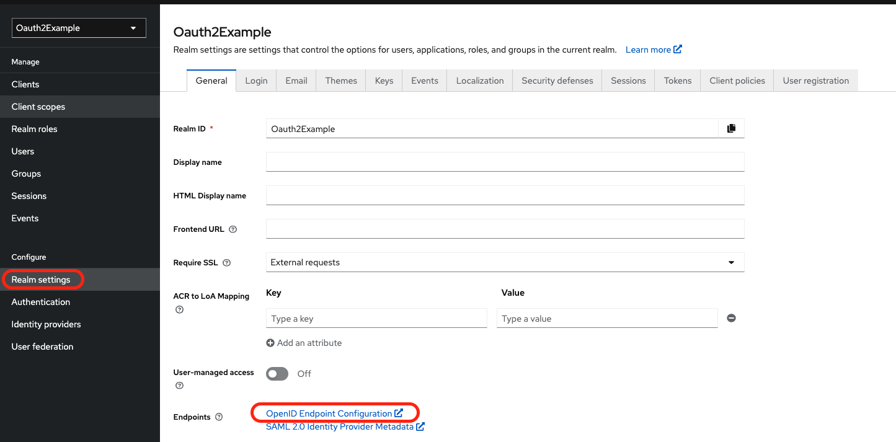
        
        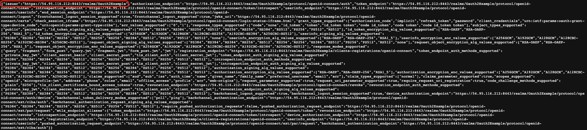
        
        redirectURI 填入與KeyCloak章節第9點 com.corgi.oauth2:/oauth2redirect/example-provider
        
        Xcode Project也要設定 URL Types
        
        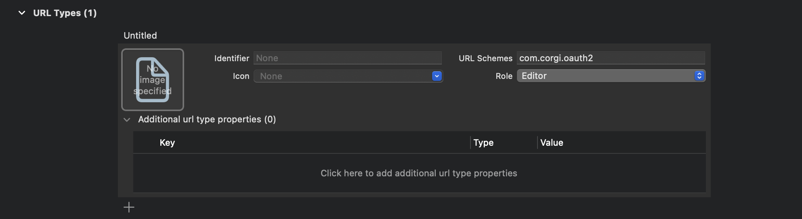
        
    5. 獲得Server的Config相關設定，並將設定存到configuration
        
        ```swift
        private func getServiceConfiguration() {
            guard let issuer = URL(string: issuer) else {
                print("Error creating URL for : \(issuer)")
                return
            }
            
            print("Fetching configuration for issuer: \(issuer)")
            
            OIDAuthorizationService.discoverConfiguration(forIssuer: issuer) { [weak self] config, error in
                if let error = error  {
                    print("Error retrieving discovery document: \(error.localizedDescription)")
                    return
                }
                
                guard let config = config else {
                    print("Error retrieving discovery document. Error & Configuration both are NIL!")
                    return
                }
                
                print("Get Configuration: \(config)")
                self?.configuration = config
            }
        }
        ```
        
    6. 方法1 : 一次完成驗證流程 ( Auth Code + Exchange Code )
        
        ```swift
        @IBAction func AutoButtonTapped(_ sender: Any) {
            guard let configuration = self.configuration else { return }
            self.doAuthWithAutoCodeExchange(configuration: configuration, clientID: self.clientID, clientSecret: nil)
        }
        ```
        
        ```swift
        private func doAuthWithAutoCodeExchange(configuration: OIDServiceConfiguration, clientID: String, clientSecret: String?) {
                
            guard let redirectURI = URL(string: redirectURI) else {
                print("Error creating URL for : \(redirectURI)")
                return
            }
            
            guard let appDelegate = UIApplication.shared.delegate as? AppDelegate else {
                print("Error accessing AppDelegate")
                return
            }
            
            print("-------------- doAuthWithAutoCodeExchange --------------")
            let request = OIDAuthorizationRequest(configuration: configuration,
                                                  clientId: clientID,
                                                  clientSecret: clientSecret,
                                                  scopes: [OIDScopeOpenID, OIDScopeProfile, OIDScopeEmail],
                                                  redirectURL: redirectURI,
                                                  responseType: OIDResponseTypeCode,
                                                  additionalParameters: nil)
            
            print("configuration: \(request.configuration)")
            print("clientID: \(request.clientID)")
            print("clientSecret: \(request.clientSecret)")
            print("redirectURL: \(request.redirectURL)")
            print("responseType: \(request.responseType)")
            print("--------------------------------------------------------")
            
            appDelegate.currentAuthorizationFlow = OIDAuthState.authState(byPresenting: request, presenting: self) { authState, error in
                if let authState = authState {
                    print("Got authorization tokens. Access token: \(authState.lastTokenResponse?.accessToken ?? "DEFAULT_TOKEN")")
                    OauthManager.shared.setAuthState(authState)
                    if OauthManager.shared.authState?.isAuthorized == true {
                        let vc = UserInfoViewController(nibName: "UserInfoViewController", bundle: nil)
                        self.pushViewController(vc)
                    }
                } else {
                    print("Authorization error: \(error?.localizedDescription ?? "DEFAULT_ERROR")")
                    OauthManager.shared.setAuthState(nil)
                }
            }
        }
        ```
        
    7. 這時候去點AutoWithExchangeCode按鈕會跑出下列錯誤，
    因為Server是使用https但目前沒有掛一張合法的憑證所以會被Apple擋下
        
        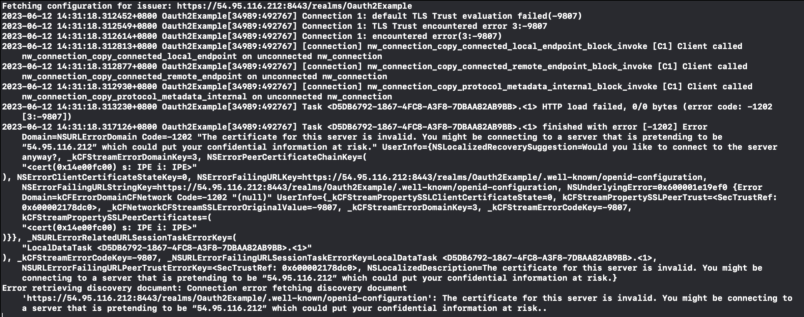
        
    8. 解決辦法
        
        ```swift
        extension HomeViewController: URLSessionDelegate {
            public func urlSession(_ session: URLSession, didReceive challenge: URLAuthenticationChallenge, completionHandler: @escaping (URLSession.AuthChallengeDisposition, URLCredential?) -> Void) {
                let urlCredential = URLCredential(trust: challenge.protectionSpace.serverTrust!)
                completionHandler(.useCredential, urlCredential)
            }
        }
        ```
        
        ```swift
        override func viewDidLoad() {
            super.viewDidLoad()
            self.title = "Login"
            let session = URLSession(configuration: URLSessionConfiguration.default, delegate: self, delegateQueue: nil)
            OIDURLSessionProvider.setSession(session)
        }
        ```
        
    9. 這時候再次點擊按鈕則會跑出另外一個問題，原因一樣是因為沒有合法的憑證。
    
    在測試時先點擊顯示詳細資訊
        
        !(Screenshot/aaa.png)
        
        再點擊`參訪此網站`
        
        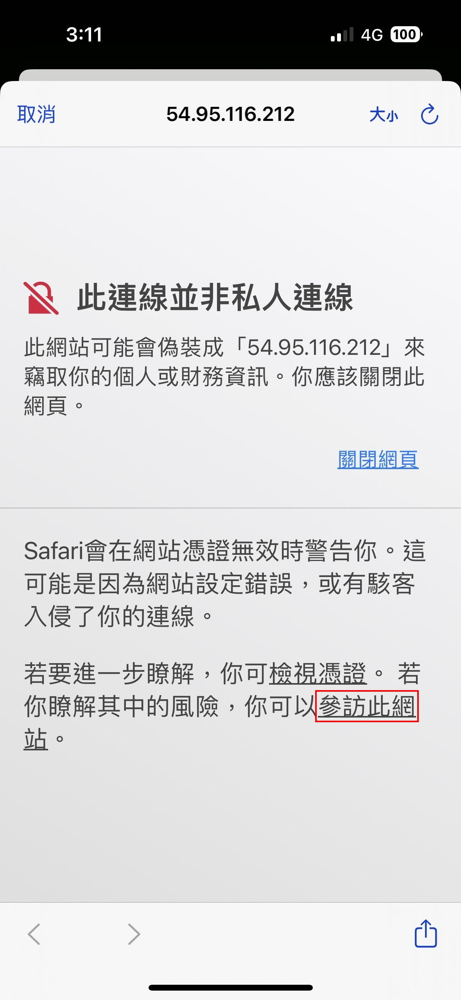
        
    10. 輸入在KeyCloak創建User的帳號密碼
        
        
        
        等入成功後會獲得 `Access Token`
        
        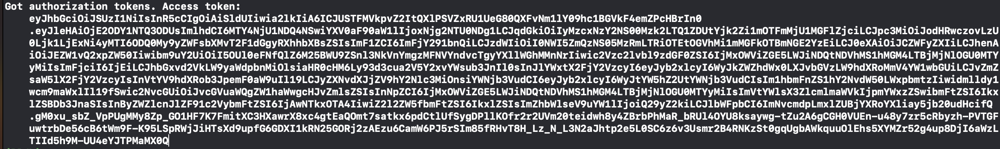
        
    
    1. 方法2: 先獲得Authorization Code 再執行 Exchange Code 獲得 Access Token
    
    先獲得 Auth Code
        
        ```swift
        @IBAction func WithOutAutoButtonTapped(_ sender: Any) {
            guard let configuration = self.configuration else { return }
            self.doAuthWithoutCodeExchange(configuration: configuration, clientID: self.clientID, clientSecret: nil)
        }
        ```
        
        ```swift
        private func doAuthWithoutCodeExchange(configuration: OIDServiceConfiguration, clientID: String, clientSecret: String?) {
            guard let redirectURI = URL(string: redirectURI) else {
                print("Error creating URL for : \(redirectURI)")
                return
            }
            
            guard let appDelegate = UIApplication.shared.delegate as? AppDelegate else {
                print("Error accessing AppDelegate")
                return
            }
            
            let request = OIDAuthorizationRequest(configuration: configuration,
                                                  clientId: clientID,
                                                  clientSecret: clientSecret,
                                                  scopes: [OIDScopeOpenID, OIDScopeProfile, OIDScopeEmail],
                                                  redirectURL: redirectURI,
                                                  responseType: OIDResponseTypeCode,
                                                  additionalParameters: nil)
            
            appDelegate.currentAuthorizationFlow = OIDAuthorizationService.present(request, presenting: self) { (response, error) in
                if let response = response {
                    let authState = OIDAuthState(authorizationResponse: response)
                    OauthManager.shared.setAuthState(authState)
                    print("Authorization response with code: \(response.authorizationCode ?? "DEFAULT_CODE")")
                } else {
                    print("Authorization error: \(error?.localizedDescription ?? "DEFAULT_ERROR")")
                }
            }
        }
        ```
        
        `Auth Code`
        
        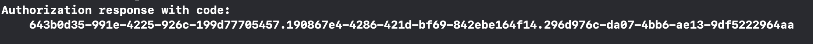
        
        拿到Auth Code後再去執行 Exchange Code 換取 Access Token
        
        ```swift
        @IBAction func ExchangeButtonTapped(_ sender: Any) {
            guard let tokenExchangeRequest = OauthManager.shared.authState?.lastAuthorizationResponse.tokenExchangeRequest() else {
                print("Error creating authorization code exchange request")
                return
            }
            
            print("Performing authorization code exchange with request \(tokenExchangeRequest)")
            
            OIDAuthorizationService.perform(tokenExchangeRequest) { response, error in
                if let tokenResponse = response {
                    print("Received token response with accessToken: \(tokenResponse.accessToken ?? "DEFAULT_TOKEN")")
                    OauthManager.shared.authState?.update(with: response, error: error)
                    if OauthManager.shared.authState?.isAuthorized == true {
                        let vc = UserInfoViewController(nibName: "UserInfoViewController", bundle: nil)
                        self.pushViewController(vc)
                    }
                } else {
                    print("Token exchange error: \(error?.localizedDescription ?? "DEFAULT_ERROR")")
                }
            }
        }
        ```
        
        `Access Token`
        
        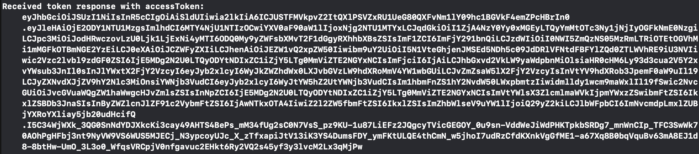
        
    
    1. 使用 Access Token 獲得 User Info
        
        ```swift
        func getUserInfo() {
              
            print("--------------------UserInfo--------------------")
            guard let userinfoEndpoint = OauthManager.shared.authState?.lastAuthorizationResponse.request.configuration.discoveryDocument?.userinfoEndpoint else {
                print("Userinfo endpoint not declared in discovery document")
                return
            }
            
            print("userinfoEndpoint: \(userinfoEndpoint)")
            
            let currentAccessToken: String? = OauthManager.shared.authState?.lastTokenResponse?.accessToken
            
            OauthManager.shared.authState?.performAction() { (accessToken, idToken, error) in
                if error != nil  {
                    print("Error fetching fresh tokens: \(error?.localizedDescription ?? "ERROR")")
                    return
                }
                
                guard let accessToken = accessToken else {
                    print("Error getting accessToken")
                    return
                }
                
                if currentAccessToken != accessToken {
                    print("Access token was refreshed automatically (\(currentAccessToken ?? "CURRENT_ACCESS_TOKEN") to \(accessToken))")
                } else {
                    //                print("Access token was fresh and not updated \(accessToken)")
                }
                
                var urlRequest = URLRequest(url: userinfoEndpoint)
                urlRequest.allHTTPHeaderFields = ["Authorization":"Bearer \(accessToken)"]
                
                print("urlRequest: \(urlRequest)")
                let session = URLSession(configuration: URLSessionConfiguration.default, delegate: self, delegateQueue: nil)
                let task = session.dataTask(with: urlRequest) { data, response, error in
                    
                    DispatchQueue.main.async {
                        
                        guard error == nil else {
                            print("HTTP request failed \(error?.localizedDescription ?? "ERROR")")
                            return
                        }
                        
                        guard let response = response as? HTTPURLResponse else {
                            print("Non-HTTP response")
                            return
                        }
                        
                        guard let data = data else {
                            print("HTTP response data is empty")
                            return
                        }
                        
                        var json: [String: Any]?
                        
                        do {
                            json = try JSONSerialization.jsonObject(with: data, options: []) as? [String: Any]
                        } catch {
                            print("JSON Serialization Error")
                        }
                        
                        if response.statusCode != 200 {
                            // server replied with an error
                            let responseText: String? = String(data: data, encoding: String.Encoding.utf8)
                            
                            if response.statusCode == 401 {
                                // "401 Unauthorized" generally indicates there is an issue with the authorization
                                // grant. Puts OIDAuthState into an error state.
                                let oauthError = OIDErrorUtilities.resourceServerAuthorizationError(withCode: 0,
                                                                                                    errorResponse: json,
                                                                                                    underlyingError: error)
                                OauthManager.shared.authState?.update(withAuthorizationError: oauthError)
                                print("Authorization Error (\(oauthError)). Response: \(responseText ?? "RESPONSE_TEXT")")
                            } else {
                                print("HTTP: \(response.statusCode), Response: \(responseText ?? "RESPONSE_TEXT")")
                            }
                            
                            return
                        }
                        
                        if let json = json {
                            print("Success: \(json)")
                            self.userAccount.text = "帳號: \(json["preferred_username"] as! String)"
                            self.userName.text = "姓名: \(json["name"] as! String)"
                            self.userEmail.text = "信箱: \(json["email"] as! String)"
                        }
                    }
                }
                
                task.resume()
            }
        }
        ```
        
        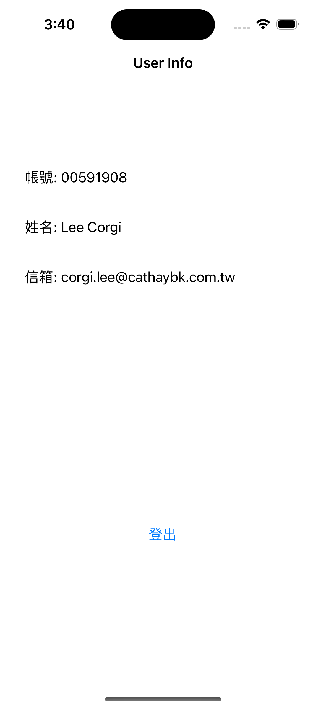
        
    2. 登出使用者
        
        ```swift
        @IBAction func logoutButtonTapped(_ sender: Any) {
              
            guard let issuer = URL(string: issuer) else {
                print("Error creating URL for : \(issuer)")
                return
            }
            
            print("Fetching sign out configuration for issuer: \(issuer)")
            
            OIDAuthorizationService.discoverConfiguration(forIssuer: issuer) { configuration, error in
                guard let config = configuration else {
                    print("Error retrieving discovery document: \(error?.localizedDescription ?? "DEFAULT_ERROR")")
                    OauthManager.shared.setAuthState(nil)
                    return
                }
                
                guard let appDelegate = UIApplication.shared.delegate as? AppDelegate else {
                    print("Error accessing AppDelegate")
                    return
                }
                
                let signoutRequest = OIDEndSessionRequest(configuration: config,
                                                          idTokenHint: (OauthManager.shared.authState?.lastTokenResponse?.idToken)!,
                                                          postLogoutRedirectURL: URL(string: self.redirectURI)!,
                                                          state: (OauthManager.shared.authState?.lastAuthorizationResponse.state)!,
                                                          additionalParameters: nil)
                
                print("-------------- signoutRequest --------------")
                print("configuration: \(config)")
                print("idTokenHint: \((OauthManager.shared.authState?.lastTokenResponse?.idToken)!)")
                print("postLogoutRedirectURL: \(URL(string: self.redirectURI)!)")
                print("state: \((OauthManager.shared.authState?.lastAuthorizationResponse.state)!)")
                print("--------------------------------------------------------")
                
                
                guard let agent = OIDExternalUserAgentIOS(presenting: self, prefersEphemeralSession: true) else { return }
                appDelegate.currentAuthorizationFlow = OIDAuthorizationService.present(signoutRequest, externalUserAgent: agent) { result, err in
                    if let result = result {
                        HTTPCookieStorage.shared.cookies?.forEach { cookie in
                            HTTPCookieStorage.shared.deleteCookie(cookie)
                        }
                        print("Sign Out Result: \(result)")
                        OauthManager.shared.setAuthState(nil)
                        if OauthManager.shared.authState?.isAuthorized != true {
                            self.popViewController()
                        }
                    } else {
                        print("Sign Out error: \(error?.localizedDescription ?? "DEFAULT_ERROR")")
                    }
                }
            }
            
        }
        ```
        
- Reference
    
    [https://medium.com/彼得潘的-swift-ios-app-開發教室/appauth-ios-實作-a0f1b09fd88b](https://medium.com/%E5%BD%BC%E5%BE%97%E6%BD%98%E7%9A%84-swift-ios-app-%E9%96%8B%E7%99%BC%E6%95%99%E5%AE%A4/appauth-ios-%E5%AF%A6%E4%BD%9C-a0f1b09fd88b)
    
    [https://medium.com/彼得潘的-swift-ios-app-開發教室/appauth-ios-實作-2-實作解析oauth2-0串接第三方登入-b8aeb9ed1ee6](https://medium.com/%E5%BD%BC%E5%BE%97%E6%BD%98%E7%9A%84-swift-ios-app-%E9%96%8B%E7%99%BC%E6%95%99%E5%AE%A4/appauth-ios-%E5%AF%A6%E4%BD%9C-2-%E5%AF%A6%E4%BD%9C%E8%A7%A3%E6%9E%90oauth2-0%E4%B8%B2%E6%8E%A5%E7%AC%AC%E4%B8%89%E6%96%B9%E7%99%BB%E5%85%A5-b8aeb9ed1ee6)
    
    [https://medium.com/彼得潘的-swift-ios-app-開發教室/appauth-ios-實作-3-實作解析oauth2-0串接第三方取得帳號資訊-8177fe587822](https://medium.com/%E5%BD%BC%E5%BE%97%E6%BD%98%E7%9A%84-swift-ios-app-%E9%96%8B%E7%99%BC%E6%95%99%E5%AE%A4/appauth-ios-%E5%AF%A6%E4%BD%9C-3-%E5%AF%A6%E4%BD%9C%E8%A7%A3%E6%9E%90oauth2-0%E4%B8%B2%E6%8E%A5%E7%AC%AC%E4%B8%89%E6%96%B9%E5%8F%96%E5%BE%97%E5%B8%B3%E8%99%9F%E8%B3%87%E8%A8%8A-8177fe587822)
    
    [https://shuninjapan.medium.com/深入淺出-openid-connect-一-8701bbf00958](https://shuninjapan.medium.com/%E6%B7%B1%E5%85%A5%E6%B7%BA%E5%87%BA-openid-connect-%E4%B8%80-8701bbf00958)
    
    [https://shuninjapan.medium.com/深入淺出-openid-connect-二-ce29649faf89](https://shuninjapan.medium.com/%E6%B7%B1%E5%85%A5%E6%B7%BA%E5%87%BA-openid-connect-%E4%BA%8C-ce29649faf89)
    
    [https://medium.com/麥克的半路出家筆記/筆記-認識-oauth-2-0-一次了解各角色-各類型流程的差異-c42da83a6015](https://medium.com/%E9%BA%A5%E5%85%8B%E7%9A%84%E5%8D%8A%E8%B7%AF%E5%87%BA%E5%AE%B6%E7%AD%86%E8%A8%98/%E7%AD%86%E8%A8%98-%E8%AA%8D%E8%AD%98-oauth-2-0-%E4%B8%80%E6%AC%A1%E4%BA%86%E8%A7%A3%E5%90%84%E8%A7%92%E8%89%B2-%E5%90%84%E9%A1%9E%E5%9E%8B%E6%B5%81%E7%A8%8B%E7%9A%84%E5%B7%AE%E7%95%B0-c42da83a6015)
    
    AppAuth GitHub:  [https://github.com/openid/AppAuth-iOS](https://github.com/openid/AppAuth-iOS)
